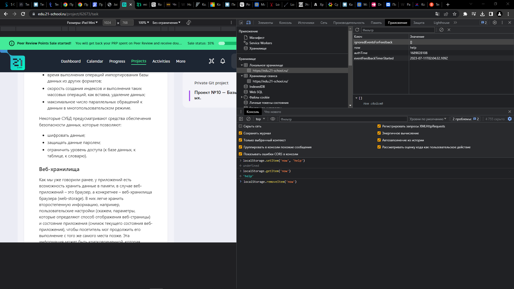
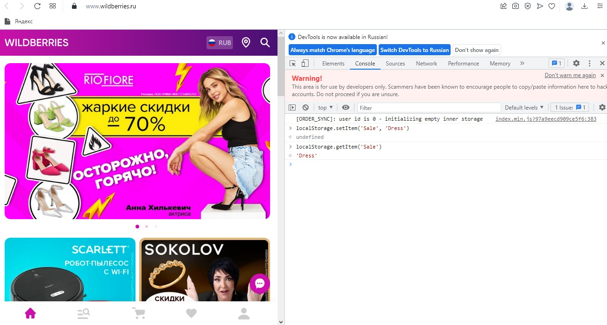
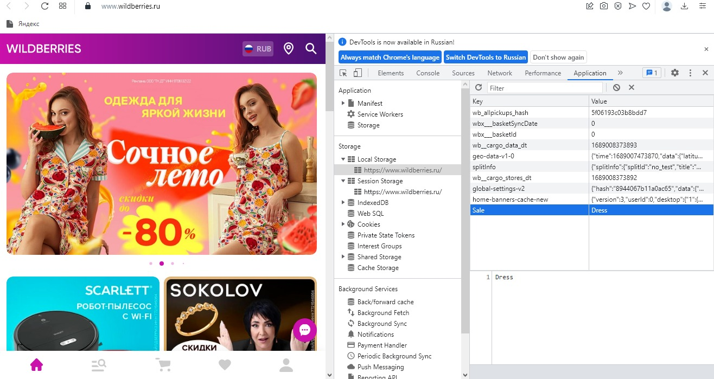
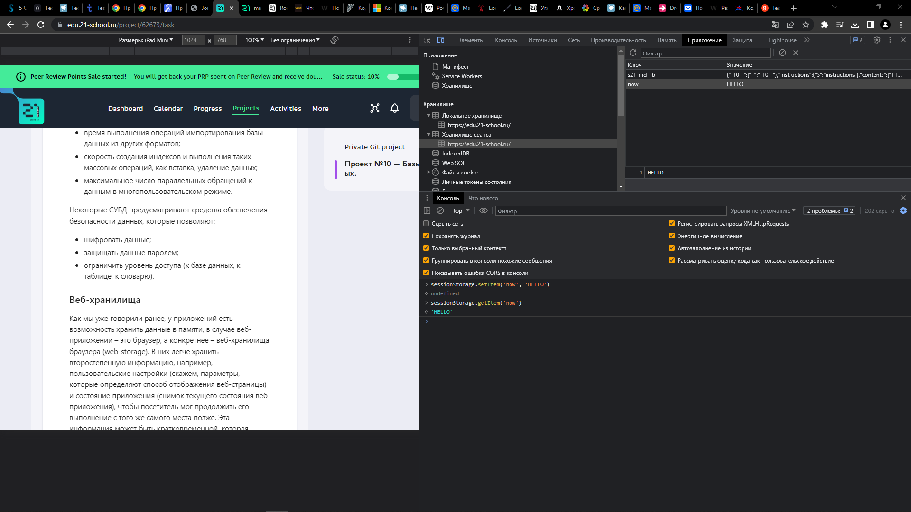
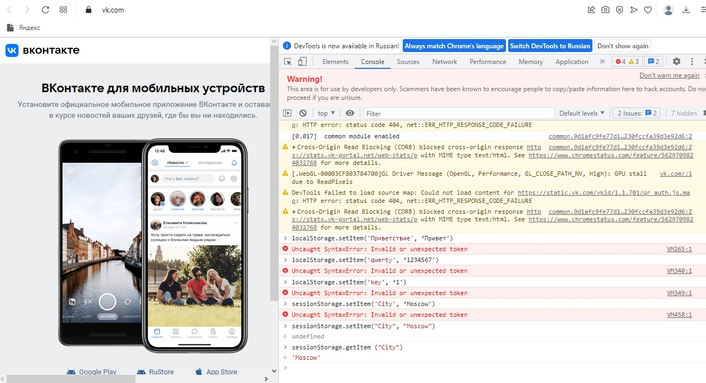
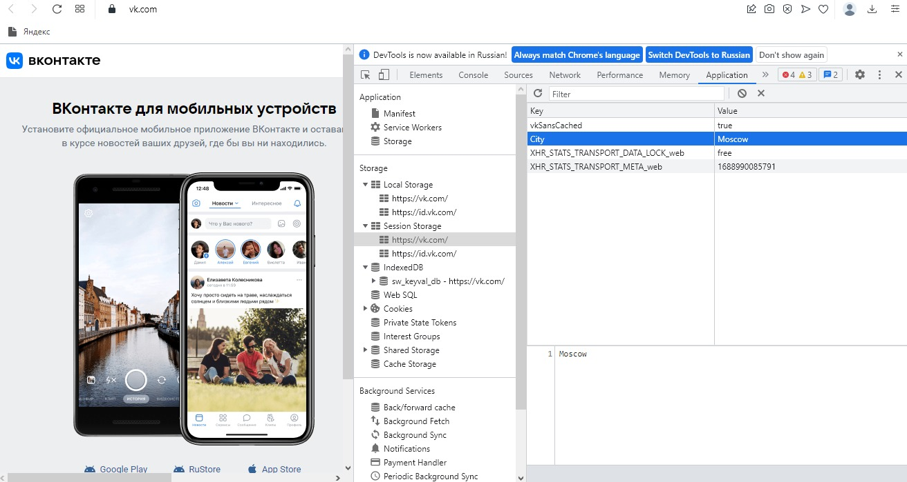

# Задание №3. Веб-хранилища

## Local Storage

|Приложение|Ключ|Значение|Описание|
|:-----:|:-----|:-----:|:-----:|
|1.https://www.gosuslugi.ru/|miniMaxConfig|endTimeLocalStorage:1689032763389|Отображется первичная страница "Робот Макс", загружаются ресурсы сайта| 
|2.https://edu.21-school.ru/|eventFeedbackTimerStarted|2023-07-10T23:57:32.086Z|Отображается дата и время начала сессии|
|3.https://habr.com/|_ym24049213_il|Хабр/Все потоки/Разработка/Дизайн/Менеджмент/Маркетинг/Научпоп|Отображает элементы меню|
|4.https://www.rendez-vous.ru/|top_brands_version|5| Отображает номер коллекции брендов|
|5.https://www.sportmaster.ru/|userLocation|{"data":{"geoId":"551487","city":"Kazan’",  "region":"Tatarstan Republic","regionId":"TA","country":"RU",  "cName":"Russia","request":"06be0222eea498798bb6a54b99370650",  "latitude":"3821ac18ca91e10e2fa4f3c7962f8842",  "longitude":"b20ff689496231189676bce1b6fd461f"},  "_expires":1689121689000}| Отображает регион пользователя|
|6.https://yandex.ru/job|_ym44830285_il|Профессии/Вакансии/Грода/|Отображает элементы меню, ключ неизменный элементы меняются |

## Session Storage

|Приложение|Ключ|Значение|Описание|
|:-----:|:-----|:-----:|:-----:|
|1.https://www.gosuslugi.ru/|__est__|MDA0VGg=3GdjxQ==|Отображает номер телефона в окне авторизации|
|2.https://edu.21-school.ru/|s21-md-lib|{"-10--":{"1":"-10--"},"instructions":{"5":"instructions"},"contents":{"11":"contents"},"chapter-i":{"33":"chapter-i"},"общая-инструкция":{"35":"общая-инструкция"},"chapter-ii":{"50":"chapter-ii"},"базы-данных":{"52":"базы-данных"},"задание-1-типы-баз-данных":{"62":"задание-1-типы-баз-данных"},"основы-работы-с-субд":{"80":"основы-работы-с-субд"},"веб-хранилища":{"102":"веб-хранилища"},"задание-2-веб-хранилища-1":{"108":"задание-2-веб-хранилища-1"},"задание-3-веб-хранилища-2":{"116":"задание-3-веб-хранилища-2"},"задание-4-свойства-веб-хранилищ":{"127":"задание-4-свойства-веб-хранилищ"},"chapter-iii":{"137":"chapter-iii"},"sql":{"139":"sql"},"задание-5-язык-sql":{"149":"задание-5-язык-sql"},"sql-запросы":{"156":"sql-запросы"},"задание-6-создание-sql-запросов":{"188":"задание-6-создание-sql-запросов"},"chapter-iv":{"194":"chapter-iv"},"тестирование-базы-данных":{"196":"тестирование-базы-данных"},"классификация":{"200":"классификация"},"задание-7-нагрузка-стресс-и-отказоустойчивость":{"207":"задание-7-нагрузка-стресс-и-отказоустойчивость"},"double-check":{"215":"double-check"}}|Отображается задание|
|3.https://habr.com/|sessionId|	5926951689034105639|id сессии|
|4.https://www.rendez-vous.ru/|AF_BANNERS_SESSION_ID|1689035317983|Отображает id рекламного баннера на странице сайта "Рандеву"|
|5.https://www.sportmaster.ru/|ins-first-page-view|1| Отображает версию загрузки первичного экрана|
|6.https://yandex.ru/job|__ym_tab_guid|3ff6165c-aa11-5312-29f2-b81487c82b02||

## IndexedDB

|Приложение|Ключ|Значение|Описание|
|:-----:|:-----|:-----:|:-----:|
|1.https://www.sportmaster.ru/|INSIDER_WEB_PUSH_DB|Версия 2, Хранилище 5| База данных
|2.https://www.sportmaster.ru/|idb_arcid|Версия 1, Хранилище 1|База данных
|3.https://yandex.ru/job|mssngr_data_support_v12_455a1d22-97f7-4221-b144-3372b40d4395|Версия 1, Хранилище 4|База данных|

### Добавлен ключ и выведено значение LocalStorage

### Удалены ключ и значение LocalStorage

### Добавлен ключ и выведено значение SessionStorage

### Удалены ключ и значение SessionStorage

